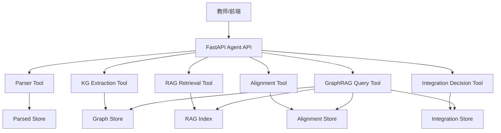

# Agent 架构说明

## 架构总览

本项目采用单 Agent 编排、多工具服务协作的后端架构。原因是黑客松时间有限，核心评分更看重设计决策、证据链和端到端闭环，而不是 Agent 数量。当前 Agent 的职责是根据教师意图调用解析、KG、对齐、整合、RAG 和 GraphRAG 服务，并把每一步的结果落到可审计数据结构中。

## 为什么选择单 Agent

多 Agent 适合长期自治和复杂协作，但本赛题的关键风险在于教材解析和证据链。如果过早拆成多个自治 Agent，会增加状态同步和错误追踪成本。单 Agent 编排的好处是：

- 数据契约统一：所有工具都围绕 `RawFile/Element/Section/Chunk/Node/Edge/Decision` 工作。
- 证据链更稳：Agent 不直接改写原始数据，只追加可追溯结果。
- 前后端更易协作：前端只需要按 OpenAPI 消费稳定接口。
- 失败更可恢复：每一步都有独立存储和 job status，可重试。

## 工具职责

- Parser Tool：解析 PDF、MD、TXT、DOCX、XLSX、CSV、TSV、PPTX，输出统一 JSON。
- Upload Tool：支持大文件分片上传、合并、异步解析和任务轮询。
- KG Extraction Tool：按 section 调用 Responses API LLM 抽取知识点和关系；没有 LLM 或证据不足时使用 fallback。
- RAG Tool：构建 chunk 证据索引，支持 hybrid BM25 + hash embedding 检索。
- Alignment Tool：跨教材识别 same/refine/conflict 候选。
- Integration Tool：生成 merge、keep、remove、refine、conflict 决策，并控制压缩率。
- GraphRAG Tool：组合 chunk、node、path、decision，返回可追溯回答。

## RAG Pipeline

1. Section 被切成约 700 字符 chunk，80 字符 overlap。
2. 每个 chunk 记录教材、章节、页码或行号。
3. RAG 检索使用 BM25、hash embedding 和 query coverage 混合打分。
4. GraphRAG 在 chunk 命中基础上补充 KG node、edge path 和 integration decision。
5. 回答必须带 citations；无可靠命中时返回“当前知识库中未找到相关信息。”

当前 7 本书试跑结果：chunk 数 5,782，RAG index 覆盖 7 本教材，source locator 覆盖率 100%。

## Prompt 工程

KG 抽取 prompt 采用 schema-first 约束：

- 节点字段：`name`、`definition`、`category`、`aliases`、`source_quote`。
- 边字段：`source`、`target`、`relation_type`、`description`、`source_quote`。
- 关系类型限定为 prerequisite、parallel、contains、applies_to、causes、leads_to、explains、is_a、part_of、contrasts_with。
- 要求 source_quote 是原文短句，不允许引入教材外常识。

后处理会再次校验 source quote。无法落回 chunk 原文的节点和边不会进入 KG。

## 量化验证

真实 LLM 单书试验使用 `05_病理学` 前 12 个 section：

- API：Responses API。
- 模型：`gpt5.4`。
- LLM calls：12。
- errors：0。
- grounded sections：12。
- nodes：94。
- edges：108。
- node evidence coverage：100%。
- edge evidence coverage：100%。
- 关系类型：10 类。

全量 7 本书 fallback 流程验证：

- 教材：7 本。
- 页数：2,567。
- chunks：5,782。
- KG nodes：5,619。
- KG edges：3,862。
- alignment clusters：44。
- integration decisions：3,935。
- compression ratio：7.45%。

## 已知局限

- 真实 LLM 全量 7 本书还没有跑完，当前只验证了单书 12 section。
- 章节结构仍依赖规则识别，复杂目录、页眉页脚和 OCR 噪声仍会影响 section 质量。
- 本地 hash embedding 适合 demo 和离线测试，但语义召回不如专业 embedding。
- 教师对话修改决策的局部重算接口还未作为完整产品闭环完成。

## 创新点

1. 证据优先的 KG 抽取：LLM 不是直接写入图谱，必须通过 source quote grounding。
2. 多层 KG 设计：区分 document tree、concept KG、evidence graph、alignment、decision、teacher edit、GraphRAG retrieval。
3. 决策可解释压缩：压缩不是删除原图，而是生成可审计 decision，并保留被压缩内容的来源。
4. GraphRAG 返回结构化中间结果：前端可以同时展示答案、引用、知识点命中、路径和整合决策。
