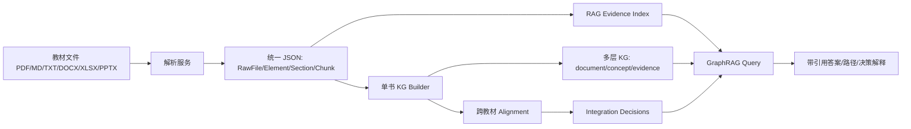

# 系统设计

## 总览

系统采用 FastAPI 后端和 React/Vite 前端分离架构。当前后端已实现教材解析、任务状态、分片上传、RAG 索引、单书 KG、多层 KG、跨教材术语对齐、整合压缩决策和 GraphRAG 查询。



## 模块划分

- `backend/app/api/routes`：HTTP API 层，提供 health、textbooks、uploads、jobs、graph、kg、alignment、integration、rag、graphrag。
- `backend/app/models/schemas.py`：前后端共享的数据契约。
- `backend/app/services/converted_textbook_importer.py`：导入已转换教材，构建 page、section、chunk。
- `backend/app/services/uploaded_file_parser.py`：解析上传文件，支持 PDF、Markdown、TXT、DOCX、XLSX、CSV、TSV、PPTX。
- `backend/app/services/knowledge_graph_builder.py`：单书知识点与关系抽取，支持 Responses API LLM 和 deterministic fallback。
- `backend/app/services/layered_graph_builder.py`：构建 document tree、concept KG、evidence graph。
- `backend/app/services/alignment_builder.py`：跨教材术语对齐。
- `backend/app/services/integration_builder.py`：跨教材整合、压缩和决策解释。
- `backend/app/services/rag_index.py`：本地 hybrid BM25 + hash embedding 检索。
- `backend/app/services/graphrag_query.py`：组合 chunk、node、path、decision 的 GraphRAG 查询。

## 数据流

1. 文件进入解析层，生成 `RawFile`、`DocumentElement`、`Section`、`Chunk`。
2. `Chunk` 进入 RAG 索引，每条保留 source locator。
3. `Section + Chunk` 进入 KG Builder，LLM 或 fallback 输出 `KnowledgeNode`、`KnowledgeEdge`。
4. 单书 KG 与原始 chunk 组合为多层 KG。
5. 多本书的 KG 节点进入 alignment，输出 cluster、canonical concept 和候选关系。
6. alignment 进入 integration，输出 merge、keep、remove、refine、conflict 决策和压缩统计。
7. GraphRAG 查询同时读取 RAG index、KG、alignment 和 integration，返回答案、引用、路径与决策。

## API 示例

构建知识图谱：

```json
POST /api/graph/build
{
  "raw_file_id": "raw_ab05b412123d4f7d",
  "force_rebuild": true,
  "max_sections": 12,
  "max_nodes_per_section": 10,
  "use_llm": true
}
```

GraphRAG 查询：

```json
POST /api/graphrag/query
{
  "question": "学习动作电位前要先学什么？",
  "top_k": 5,
  "raw_file_ids": ["raw_a", "raw_b"],
  "include_decisions": true
}
```

典型响应包含：

- `answer`：基于证据拼装的回答。
- `citations`：chunk 级引用。
- `source_chunks`：原始证据片段。
- `node_hits`：命中的 KG 节点。
- `paths`：图谱路径，如 `PREREQUISITE_OF`。
- `decisions`：相关整合决策。

## LLM 接入

LLM 使用 OpenAI-compatible Responses API，配置项如下：

```env
LLM_PROVIDER=openai-compatible
LLM_API_STYLE=responses
OPENAI_BASE_URL=http://your-api-gateway/
OPENAI_MODEL=gpt5.4
OPENAI_API_KEY=...
LLM_TIMEOUT_SECONDS=120
LLM_MAX_TOKENS=2200
```

后端优先调用 `/v1/responses`。如果兼容服务不支持 Responses API，会回退到 `/v1/chat/completions` 或 `/chat/completions`。LLM 输出必须是 JSON，且每个节点和关系的 `source_quote` 必须能落回原文，否则不会入图。

## 工程取舍

- 当前没有引入重型 GraphRAG 框架，先保证数据契约、证据链和可解释路径稳定。
- 本地 embedding 使用 hash embedding，便于离线 demo 和测试复现；可替换为 BGE、OpenAI Embedding 或 Qdrant。
- LLM 只做 KG 抽取，GraphRAG 回答仍采用 grounded 组装，避免无证据生成。
- 所有生成数据写入 `data/`，默认不提交到 git。
